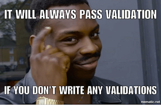
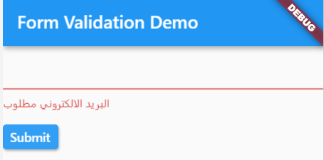
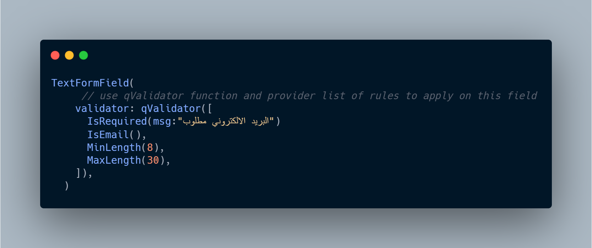

  
  


يعني ايه validation ؟ 

لو ترجمنا المصطلح الي موجود علي اغلب المواقع هنلاقي انها

:::info
عملية تاكد من شكل البينات وليس صحتها 
:::

فمثلا لو عملنا فاليديشن للبريد الالكتروني 

المفروض يكون مكون من3 اجزاء

- username اسم المستخدم 
- رمز ال @
- الثالث domain رابط المواقع

وبكدا الفاليديشن للبريد الالكتروني هو مجرد التاكد من توافر ال 3 اجزاء دول في البريد 
كمثال
|القيمه | الحاله  |
|-|-|
|ahmed@masoud.com | بريد الكتروني صحيح |
|ahmed-masoud.com |  بريد الكتروني غير صحيح علشان مفيش فيه @ |

وهكذا مجرد تاكد من شكل وطول ونوع البيانات 

:::note

موضوع المقاله هو توضيح التاكد من شكل وطول ونوع وقيمه البيانات وليس صلاحيتها الفعليه

:::


:::tip
يفضل التاكد من البيانات في جهاز العميل قبل ارسال البيانات للخادم (السيرفر) 

لتحسين تجربه المستخدم (UX) وبعض الاحيان تقليل الضغط علي الخادم
:::

 
## ازي نطبق الكلام ده في Flutter
:::note
ال validation مش متعلق بلغه البرمجه ولا باطار عمل `framework`  معين تقدر تطبيق المفهوم في كل لغات البرمجه وكل اطارات العمل بلا استثناء
:::

الموقع الرسمي لما شرح الطريقه دي 
[رابط](https://flutter.dev/docs/cookbook/forms/validation)

استخدمها مع `Form Widget` و `TextFormField` Widget علشان موجود فيه باراميتر ال `validators`
وده بياخد `String Function(String val)`
عباره عن فانكشن بتستقبل متغير من نوع `String` فلاتر بتبعتلك فيه القيمة الي الي المستخدم كتبها فيه
وانت بنفسك بتعمل اي عمليه انت حابب تعملها وقدامك في الاخر ترجع حاجه من 2 اما `null` وبكدا الحقل ده سليم ومفهوش مشاكل 
ياما `String` ولو رجعت متغير سترنج فلاتر هتعرض القيمة الي فيه كانها رساله الخطا تحت الحقل علشان المستخدم يفهم اليه الخطا
 
 ```dart
TextFormField(
  // The validator receives the text that the user has entered.
  validator: (value) {
    if (value.isEmpty) {
      // If is empty, return an error message indicating email is required.
      // Arabic for "Email is required"
      return 'و البريد الالكتروني مطلوب'; 
    }
    // If the value is not empty, return null to indicate no errors.
    return null;
  },
);
 ```


كدا في حاله ان المستخدم مكتبش حاجه وسابو فاضي فلاتر هتطلع Text تحت خانه البريد وتظهر فيها الرساله الي انت لسه عامل ليها return 

  

طيب دلوقتي انت عرفت ازاي تاخد القيمة وتعرض رساله الخطا مع فلاتر بس بدون مكتبات وبدون كتابة كود كتير مجرد داله بتحدد اذا كان تمام او لا في خطا والرساله بتاعتو كزا 

## مكتبة : Queen validators 👑
ايه الفايده من المكتبة وامتي اكون محتاج ليها ؟

تحتوي المكتبه علي اكواد جاهزه للمساعده في التحقق من اكثر من نوع وشكل للبيانات

اول شي الاعتامد علي المكتبه في المشروع 
```yaml
  dependencies:
    queen_validators: ^2.0.0
```
ازاي المكتبة بتشتغل ؟ 
نفس الطريقة كالمثال السابق ونفس ال widgets  مع تغيير بسيط

  


qValidators بيحتاج منك List جواها عناصر من نوع QueenValidationRule

والمكتبة بتوفرلك انواع كتير من validation بسهوله جدا

كل الي عليك تختار من المكتبه انت محتاج ايه 

محتاج تتاكد ان الحقل اتكتب فيه قيمها ؟ استخدم IsRequired 

محتاج تتاكد انو بريد الكتروني صحيح ؟ استخدم IsEmail

محتاج تتاكد ان طول البيانات اكبر من او اقل من عدد معين ؟ استخدم MinLength او MaxLength

وهكذا ......

:::tip
لتعديل رساله الخطا الي بتظهر في حاله الفشل  

لكل Rule موجود في المكتبه متغير اسمه message وهو من نوع String يمكنك تغييره من ال constructor
:::