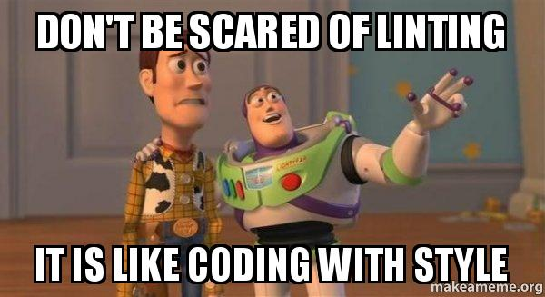

<!-- truncate -->
  
## المقصود بالــ linting
لغه يعني " الفحص " والمقصود هنا فحص الكود الي انت كتبته علشان يخليك تكتب الكود بافضل طريقه بالاضافه انه ممكن ينبهك لبعض المشاكل في الكود
من بعض الاستخدامات مثلا

:::tip
يشار الي عمليه ال linting ب مصطلح static code analysis
:::
 الــ linter هو برنامج يعمل في الخلفيه وظيفته قراه الكود الي كتبته ويحدد مشاكل معروفه مسبقا لو حصلت في الكود بتاعك  كمثال

- لو نسيت تحدد ال `always_declare_return_types` return type
- لو فتحت Stream ونسيت تعمل  `close_sinks` close

:::note
هتلاقي هنا كل ال rules المتاحه
[Linter Rules 🔗](https://dart.dev/tools/linter-rules)
:::

## الفائده من استخدام static code analysis

- تقيل من احتمالية وجود اخطاء في الكود
- كود افضل واسهل في القرائة
- المحافظة علي المعايير القياسية في الكود ( code style guideline )
شكل الكود كـ انه من شخص واحد ( الكل بيكتب بنفس المعايير ومحافظ علي نفس الشكل (style)

:::warning

تفضل تكتشف الاخطاء اثناء كتابه الكود ولا اثناء ال production ?
دي من اهم الاشياء الي هيساعدك فيها الــ lint
:::

طب استخدم الموضوع ده ازاي مع دارت وفلاتر ؟

تقدر تعمل بنفسك ملف الــ `analysis_options.yaml` في ال `root` بتاع البروجكت  (جنب ملف ال `pubspec.yaml`) وتحط فيه القواعد الي هتكون ال style الي الكل هيمشي عليه في المشروع

الموضوع هناء بدائي ويفترض ان شخص عنده خبره كبيره يحط القواعد دي ويظبط الملف ده كويس

طب لو لسه خبرتك مش قد كدا ومحتاج تلتزم ب style معين حد خبير عملو ؟

تقدر تسخدم مكاتب متخصصه للموضوع ده زي

- `pedantic` ( الاولي في الترتيب والمستخدمه من جوجل مع دارت)
- `lint` ( القواعد فيها اشد من الاولي ومدعومه من مجتمع دارت وفلاتر ) .
- في مكتبات تانية غيرهم بس دول اشهر اتنين .
بعد ماتقرا عنهم وتحدد انت هتستخدم اي مكتبة منهم كل الي عليك تستخدم المكتبة في ال `pubspec`

وكل مكتبة ليها path معين تحطه في ملف ال analysis_options.yaml الي لسه متكلم عنو فوق ويبقي بالشكل ده

:::note
الموضوع مش في فلاتر فقط فكره static code analysis موجوده في كل لغات البرمجه
:::

## الملخص

اعمل linting مش هتخسر حاجه اقرا اكثر عن المكتبة الي هتستخدمها مش مجرد تركيب بس  تقدر تعدل علي قواعد المكتبة الي استخدمتها
