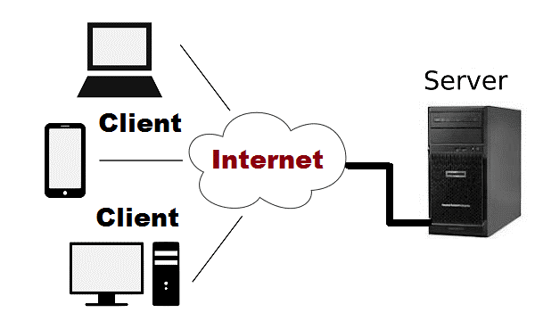

<!-- truncate -->
## مقدمه

مشاركه البيانات بين الاجهزه وبعضها البعض هي الطريقه الي يعمل بها الانترنت
لكن لو قربت اكثر للفكره هي تخزين البيانات في جهاز مركزي(server side) وباقي المستخدمين
(client side)
 يحصلون علي البيانات منه
:::tip
المقصود بــ client side
هو جهاز المسختدم سوا كان موقع في متصفح او تطبيق مثبت علي الويندوز او الموبيل
:::

:::tip
المقصود بــ server side
هو السيرفير المستخدم في معالجه وتخزين البيانات سوا كانت اي لغه البرمجه او اطار العمل المهم انه جزء الباك اند
:::

## لماذا الفصل بينهم

اسباب كثيره ومختلفه ومن اهمها علي سبيل المثال

- الحماية
   لو الكود كله عند العميل ممكن يسرقة او يعدلة
- السرعه او الاداء
 في فرق ملحوظ بين قوة جهاز العميل الي ممكن يكون جهاز متواضع موبيل بسيط او كمبيوتر مش قوي علي عكس السيرفير الي اداء ممكن يكون 100 مره اقوي من العميل وبالتالي بعض العمليات لو تمت علي جانب السيرفير هتكون اسرع بكثير 

:::note
مهما كان الباك اند المستخدم تقدر تعمل بيه الانواع المختلفه من الـ api والانواع المختلفه من البيانات الي هتتنقل بدون اي اختلاف يهمك في جانب العميل (client side)
:::

## مفهوم ال API

 ولو عاوز تفاصيل اكثر الفيديو ده موضح الامور بالانواع المختلفة CLI, GUI, API, Class, Interface يعنى ايه
[Youtube 🔗](https://youtu.be/7DSCTzcWhks?si=G9l1q4SJ6y6RAYnv)

## انواع ال Api المستخدمه في الربط بين client side و server side

انواع مختلفه لحل مشاكل مختلفه ولهم استخدامات مختلفه وكل فتره بيظهر نوع جديد وعلي سبيل المثال اشهرهم

- REST 🏆
- GraphQL
- gRPC
- WebSockets
  
## REST API
