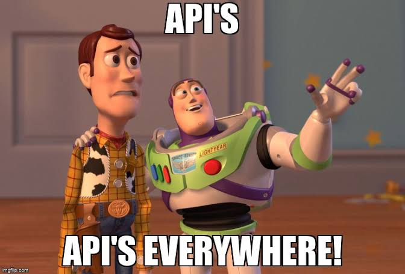
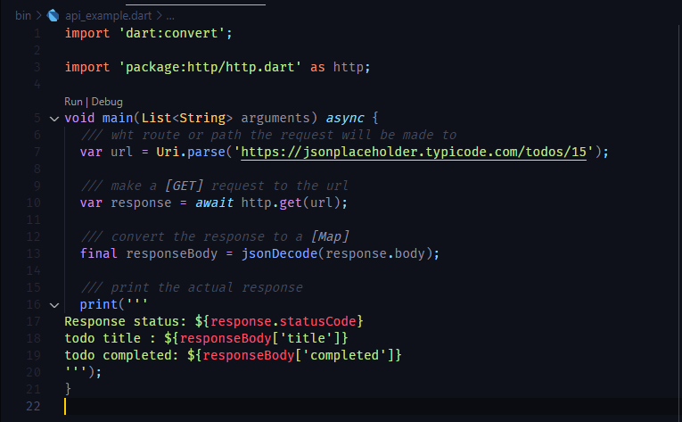
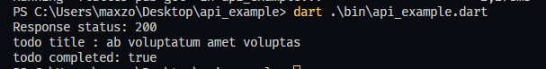

<!-- truncate -->
## مقدمه

مشاركه البيانات بين الاجهزه وبعضها البعض هي الطريقه الي يعمل بها الانترنت
لكن لو قربت اكثر للفكره هي تخزين البيانات في جهاز مركزي(server side) وباقي المستخدمين
(client side)
 يحصلون علي البيانات منه
:::tip
المقصود بــ client side
هو جهاز المسختدم سوا كان موقع في متصفح او تطبيق مثبت علي الويندوز او الموبيل
:::

:::tip
المقصود بــ server side
هو السيرفير المستخدم في معالجه وتخزين البيانات سوا كانت اي لغه البرمجه او اطار العمل المهم انه جزء الباك اند
:::

## لماذا الفصل بينهم

اسباب كثيره ومختلفه ومن اهمها علي سبيل المثال

- الحماية
   لو الكود كله عند العميل ممكن يسرقة او يعدلة
- السرعه او الاداء
 في فرق ملحوظ بين قوة جهاز العميل الي ممكن يكون جهاز متواضع موبيل بسيط او كمبيوتر مش قوي علي عكس السيرفير الي اداء ممكن يكون 100 مره اقوي من العميل وبالتالي بعض العمليات لو تمت علي جانب السيرفير هتكون اسرع بكثير 

:::note
مهما كان الباك اند المستخدم تقدر تعمل بيه الانواع المختلفه من الـ api والانواع المختلفه من البيانات الي هتتنقل بدون اي اختلاف يهمك في جانب العميل (client side)
:::

## مفهوم ال API

 والاجابة المختصرة هي كود جاهز ومنظم بطريقة انه بيديلك functions تستخدمها علشان تحقق المطلوب بالنسبالك بدون معرفة ال functions دي ازاي بتشتغل مجرد تعرف ايه ال input وايه ال output بتاع الفنكشن انت مش محتاج اكثر من كدا )

 ولو عاوز تفاصيل اكثر الفيديو ده موضح الامور بالانواع المختلفة CLI, GUI, API, Class, Interface يعنى ايه
[Youtube 🔗](https://youtu.be/7DSCTzcWhks?si=G9l1q4SJ6y6RAYnv)

## انواع ال Api المستخدمه في الربط بين client side و server side

انواع مختلفه لحل مشاكل مختلفه ولهم استخدامات مختلفه وكل فتره بيظهر نوع جديد وعلي سبيل المثال اشهرهم

- REST 🏆
- GraphQL
- gRPC
- WebSockets
  
## REST API

## نوع البيانات

انواع البيانات الي بتتنقل في بين السيرفير والكلاينت في ال api
في البداية والنهاية بيتم نقل نص String وكل الانواع دي بيتعمل encode وتتحول String والمستلم بيعملها decode ويرجعها للنوع المطلوب ( تشفير وفك تشفير )  والعميل دي بتحصل علي الجانبين المرسل بيشفر والمستلم بيفكر التشفير  ( التشفير مش سري هو يعتبر تحويل في الصغير مش تشفير )
ممكن تكون البيانات من نوع json (الاكثر انتشارا ) او xml او yaml او نوع اخر

## الارسال من العميل للسيرفير - Http Request

وهو انك ترسل بيانات من جهاز العميل للسيرفير  علشان تبعت http request للسيرفير محتاج

- المسار path او route `String`

اطر العمل المستخدمه في جانب السيرفير عنده حاجه اسمها router وده مختص انه يفرق بين كل طلب هينفذ كود ايه يعني انت عاوز تعمل دخول مثلا او عاوز تجيب احدث 5 اخبار من السيرفير او عاوز تجيب اخبار بيوم صدور الخبر  . ازاي السيرفير هينفذ الكود الي يعملك الحاجه الي انت عاوزها او ازاي هيميز انت عاوز ايه بالظبط ؟ عن طريق ال route الباك اند بيحددلك `route` ويقولك ده بيعمل كذا ساعتها انت لو محتاج حاجه تشوف ال route بتاعها وتستخدمه وال route بيكون عبارة عن مسار عادي زي مسارات نظام التشغيل "/news"  او "/news/latest" مثلا

- المحتوي الي هترسلة b`ody
 لما تكون عاوز تضيف خبر جديد من الموبيل فانت عندك عنوان الخبر ومحتوي الخبر وصورة للخبر الي المفروض يتخزنو في السيرفير دول المفروض تبعتهم في ال body بتاع الطلب

- الاستعلام `query`

 نفس الكلام زي ال `body` محتوي انت عاوز تبعته للسيرفير بس الغرض مختلفة المرادي انت عاوز تديلة بيانات يبحثلك بيها مش يخزنها عنده ( والمفترض ان ده افضل استخدام ) لكن مفيش حاجه تمنع السيرفير انه يطلب منك حاجه في ال `query` ويخزنها  عادي  ممكن تشوف شكل الكويري

- البيانات الاضافية  headers
زي ال body و query بيانات بيتم ارسالها للسيرفير بس لغرض مختلف
الغرض هنا بيانات متعلقة بالطلب نفسة request
يعني مثلا عاوز تقول للسيرفير

  - رد عليا بلغه عربية او انجليزية Accept-lang ( او حسب مالباك اند يطلب )
  - او عاوز تقول للسيرفير انا اليوزر الفلاني ( باستخدام التوكن في headers )
  - عاوز تقول للسيرفير هاتلي الداتا بنوع جيسون او يامل (accept)
  - عاوز تقول للسيرفير انا باعتلك في الركوست داتا من نوع json او form -data او نوع اخر مثلا (content-type)

- نوع الطلب(method) GET,POST,PUT....etc

ده مجرد نوع بتحدد اتباعا للدوكمنيتشن او تعليمات الباك اند هيقولك ال route ده مع ال method  دي بيعملك كذا مفترض دايما انك عارفة من الباك اند او الدوكمنتيشن الي كتبهولك
مفيش حاجه بتجبر الباك اند انه يقولك لو عاوز تضيف بيانات اعمل POST او لو عاوز تجيب بيانات اعمل GET  الامر متروك تماما ممكن يعملك API بستخدم GET علشان تمسح بيانات هو صحيح مش منطقي او مش منظم لكنة مقبول وشغال بدون مشاكل !

كدا انت جاهز تبعت ركوست للسيرفير وتديلو داتا

- نتيجة الطلب Response

لما بعتنا للسيرفير طلب لازم يجينا الرد علشان نعرف الطلب ده تم بنجاح او حصل فيه مشكلة او ايه  نوع المشكله الي حصلت هل احنا طلبنا حاجه مش موجوده 404 هل احنا طلبنا حاجه ملناش صلاحية عليها 401 هل السيرفير فيه مشكلة ومش قادر يجبلنا الي طلبناه 500
الرد بتاع السيرفير بيرجع برقم status code
في بروتوكول متبع عبارة عن رقم من 3 خانات زي فوق في 404 و 401 و 500 وعائلاتهم كل بداية رقم هي بداية عيله وبقيت الارقم بتحددلك بالضبط الخطا فين زي الايرور المعروف 404 معناه انك طلبت حاجه مش موجوده والرابط التالي فيه الراوبط من منظمه موزيلا ومعني كل واحد منهم [HTTP response status codes - HTTP | MDN](https://developer.mozilla.org/en-US/docs/Web/HTTP/Status)

ممكن تكون طالب بيانات من السيرفير ولو الكود جالك 200 يعني ok تمام مفيش مشكلة يبقي كويس بس فين بقي البيانات الي جت؟

كل response بيرجع معاه data  انت بتعملها decode  عكس الي بتعمله في ال body لما كنت بتبعت  للسيرفير (نوع البيانات الي جايه مفترض انه يطابق النوع الي انت مديلة للسيرفير في هدر الــ accept  ولو رجع مخالف للمطلوب دي مشكلة باك اند )

وبكدا نظريا انت فاهم يعني ايه http request ومحتواه والرد عليه واكواد الرد وايه الفايده من اليلة دي كلها .

## مثال مع dart

كل لغات البرمجه فيها http client تقدر تستخدمه علشان تبعت وتستقبل البيانات من السيرفير لكن مبيبقوش افضل حاجه كونهم بيدولك اقصي حرية فانت هتتحكم في كل التفاصيل حتي الي مش محتجاها فتعال نستخدم http client
:::tip
اول حاجه بروجكت دارت جديد ( هنستخدم دارت بس مش محتاجين فلاتر علشان نخلي الامور ابسط )
:::

هنستخدم http علشان ابسط رابط المكتبة علي pub.dev

هنستخدم موقع jsonplaceholder علشان نجرب لحد مايجي وقت مشروع حقيقي نستخدم لكن هي نفس التجربه بالظبط مجرد تغير ال route ال route ده `https://jsonplaceholder.typicode.com/todos/15` هيرجعلك ال todo رقم 15 مطلوب مننا نعمل print ل title ونعرف هي completed ولا لا ده هيكون شكل الكود

وده شكل ال output لما شغلت الكود

وبكدا نكون انتهينا بس في ملحوظات

- ازاي نعرض المحتوي ده علي الشاشه ونعمل loading  وهكذا  ده جزء متعلق بـ state management
- بعض الركوستات  ممكن متتمش بسبب الانترنت ودي مبيبقاش ليها status code بالعكس دي بتبقي اكسبشن احمي بنفسك ب try catch
- بعض الركوستات بتتبعت للسيرفير لكن بتاخد وقت طويل جدا وفي الاخر بتتقفل ومن غير رد رغم وجود النت لكن النت بطي او السيرفير عليه ضغط شديد خلي بالك من الـ time out
- لارافل ونود او جانجو او دوت نت كلهم بالنسبة لفلاتر ( او اي فرونت اند تاني )  حاجه واحده
رفع الملفات للسيرفير بيكون بنفس الطريقة دي لكن بتبعها في Form data بدل من json  
- رابط المشروع الي في المثال علي [github](https://github.com/maxzod/api_example)
