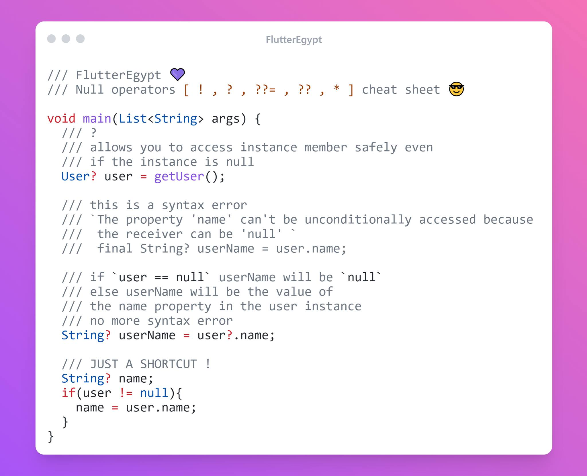
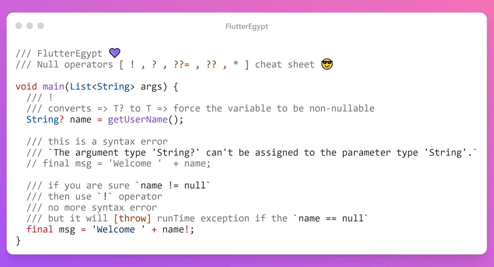
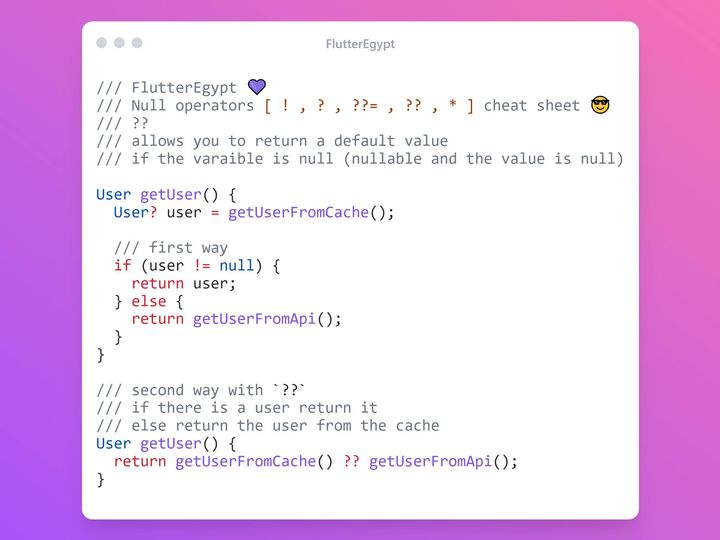
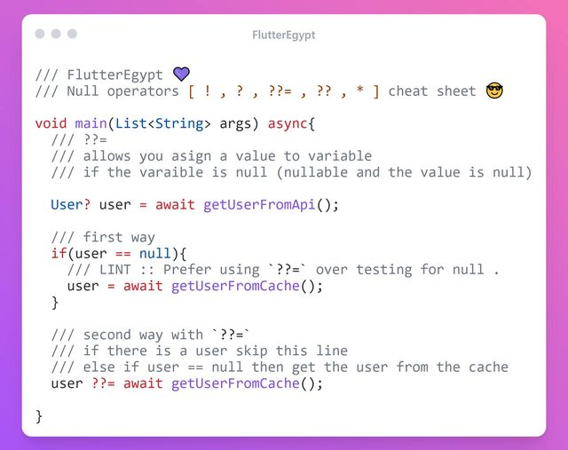

<!-- truncate -->

 

## المقصود بالـ null

القيمة الفارغة أو "النُل" في برمجة الحاسوب تشير إلى عدم وجود قيمة فعلية لمتغير معين. تُستخدم القيمة الفارغة بشكل شائع لتمثيل حالات عدم الوجود أو البيانات المفقودة

لنسبط الامور اكثر

```dart
String foo = 'hello world 👋';
```

 'hello world 👋' بتنفيذ السطر اعلاه يتم حجز مساحه للمتغير في الزاكره واستخدام تلك المساحه لتخزين كلمه

   لكن اذا حذفنا القيمه وعرفنا المتغير بدون القيمه يتم حجز المساحه في الزاكره وتكون قيمتها فراغيه اي null

```dart
String foo;
```

## المقصود بالـ null safety

null safety باختصار اضافه للغات علشان تقلل من مشاكل ال run time  الي تسبب فيها ال null
تقدر تشوف بالتفصيل القصه كامله  [ هنا🔗 ](https://www.youtube.com/watch?v=6DBR7DDvH8I)

تم اضافه بعض الرموز لحل مشكله ال null

`?` ، `!` ، `??=` ،  `??` ، `*` , `late`

## رمز `?`




- الرمز ده هتستخدمه مع المتغيرات ال nullable فقط
  
- المشكله الي بتحلها علامه الاستفاهم دي ؟
لو عندك متغير ممكن يكون ب null وليكن مثلا User وعاوز تجيب اسم اليوزر ده او اي قيمه جواه age ,address , email الخ  لازم تتاكد انه الاول مش null علشان تستخدم القيمه الي جواه لان مش من الطبيعي تستخدم حاجه وهي ب null اساسا

- فالطريقه الاولي دلوقتي انك تعمل زي اخر مثال في الصورة وتعمل if else بطريقه فلاتر ال declarative علشان نستخدم دي في الكود مش هتبقي كويسه ( من ناحية شكل الكود فقط ملهاش تاثير علي السرعه )

-  وهنا يجي دور ال " ? "
هتخليك تستخدم متغير nullable وتستخدم خاصية من جواه (property)وتختلف النتيجة حسب قيمه المتغير نفسه يعني اعتبرها اختصار في الكود واسهل للقرائة
مثال :

لو في متفير نوعه User وجواه خصائص اليوزر نفسه ( الاسم كامل و العمر و العنوان ... الخ ) الحجات دي كلها جوا المتغير بتاع اليوزر ومنقدرش نوصلها الا لو كان معانا اوبجكت من User وليس فقط متغير قيمته nullلو عملنا مستخدم جديد وادنالو اسم ahmed 


 User ahmed = User();

الاول الاوبجكت او المتغير الاساسي الي هو ahmed

والثاني متغير جوا احمد وهو name

لو استخدمنا معاهم " ؟ "

زي المثال الي في نصف الصورة

لو المتغير الاساسي(user) قيمته == null يبقي الناتج هيكون null

لو المتغير الاساسي (user) قيمته مش null يبقي الناتج هيكون قيمه اسم اليوزر (user.name)

## رمز `!`



 المتغيرات في dart بقت nullable - قابل ان قيمتة تساول null
non-nullable - لا يقبل ال null ابدا وبالتالي انا لو بحاول احط قيمته حاجه من النوع الاول للنوع الثاني ال analyzer وانا بكتب الكود هيظهرلي الخطا الي في الصورة انه مش قادر يحط nullable في non nullable

- وحل المشكلة هو استخدام علامه التعجب دي " ! " ( الطريقه الخطر ) ومعناها ان انا متاكد ان ال المتغير الاول ( nullable ) قيمته حاليا مش ب null وبجبرك تحط قيمته في المتفير الي من نوع non-nullable

وده من اخطر الامور الي لازم تكون متاكد منها قبل استخدمها بنسبة 100% لانك لو اجبرته علي كدا وطلعت قميته المتغير ب null
ده هيبسبب اكسبشن في ال run time ( والكود شغال )

## رمز `??`



الرمز ده بيوفر عليك انك تعمل return لقيمه افتراضية في حاله ان المتغير الاساسي ب null
- مثلا اخر مره اليوزر يفتح فيها التطبيق 
  هنقول الـ last login  اول مره طبيعي تبقي null
ولو عاوزين نعمل سلوك انها دايما ترجع تاريخ حتي لو كان المستخدم اول مره يفتح التطبيق
(اخر تسجيل دخول هيبقي تاريخ الوقت ده)
هتبقي
```dart
return lastDate ?? DateTime.now();
```
رجع قيمه اخر تسجيل دخول ولو مفيش قيمة سابقة لاخر تسجيل دخول رجع التاريخ الحالي .
 
## رمز `??=`



ده مجرد اختصار للطريقه الاولي الي في الصورة

ودورة تعيين قيمه للمتغير في حاله ان فيمه المتغير == null

ولو مش null متحطش القيمة دي

## late
استخدام الكلمة دي لما يكون عندك متغير من اي نوع وليكن مثلا TabController وفي معظم الحالات الكنترولر ده هتديلو قيمتة في الـ initState
اذن هنا حاجتين

1 - ان المتغير ده مش هيبقي nullable لانك متاكد 100% في ال initState هتديلو قيمتة

2- ان المتغير ده مش هتقدر تديلو قيمتة وقت ال declration (وقت كتابة كود المتغير نفسة ) لكن هتديه في المستقبل

وهنا يجي الفايدة من كلمة late لان في حاله تفعيل ال null safety لابد ان المتغير يكون non nullable وياخد قيمة او انه يكون nullable  والحاله الوسط هي ال late 

وحاول دايما قدر المستطاع تتخلي عن الكلمة دي
لان باختصار انت بتقول لل analyzer بتاع dart
اعتبر الكلمة دي non-nullable وانا هحط القيمة بمعرفتي

وبالتالي هو مش هيقدر يساعدك او يحميك لو استخدمت متغير late من غير متحط قيمتة
ساعتها هيديلك الايرور المعروف
`LateInitializationError`
