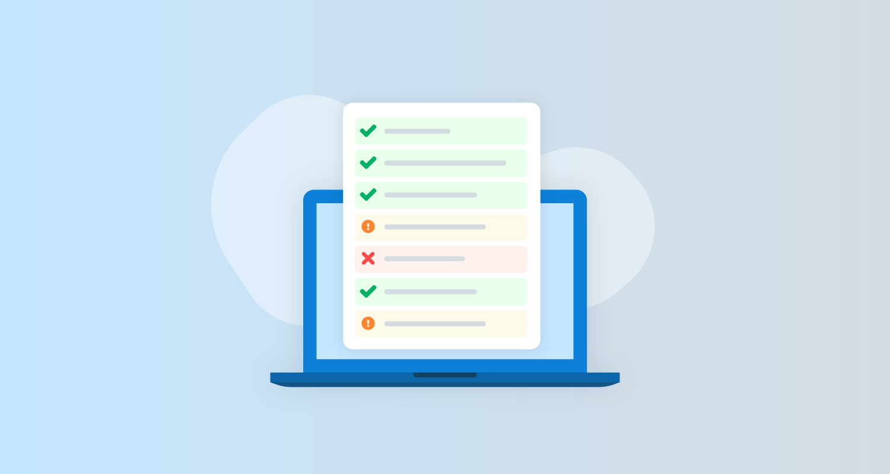


<center>
 بسم الله، والصلاة والسلام على رسول الله  الحمد لله الذي عَلَّمَ بالقلم.. عَلَّمَ الإنسانَ ما لم يَعْلَم والصلاةُ والسلامُ على خيرِ مُعَلِّمي الناسِ الخير محمد.. الهم علمنا ما ينفعنا وانفعنا بما علمتنا انك انت العليم الحكيم .
</center>

:::info
 الهدف من unit testing هو ضمان صلاحية الكود في اتمام المهمه المقصود بها اثناء تطوير البرنامج 
:::


# المثال الاول


```
مطلوب كتابة دالة لمعرفة هل عمر المستخدم اكبر من 18 عام ام لا 
اذا كان اكبر من 18 عام تكون True
واذا كان اقل من 18 عام تكون False 
```

## كتابه الداله
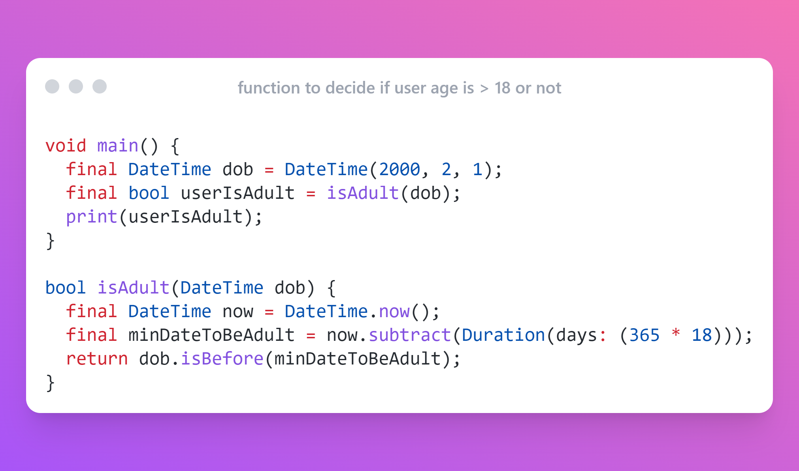

## اختبار الدالة 

:::note
 الصحيح ان تكتب الاختبار اولا ثم الكود بعد ذلك  لكن قمنا بالعكس للتوضيح فقط
:::

### المكاتب المستخدمه لاختبار الكود

نحتاج لمكتبة test  كـ dev_dependencies
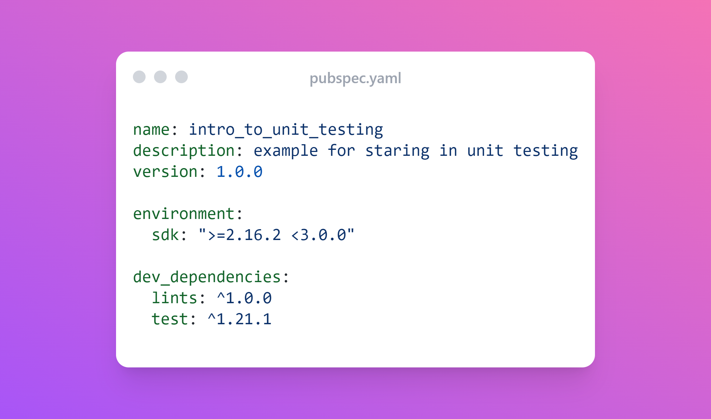

### كتابة الاختبار
:::info
في المسار الرئيسي للمشروع داخل ملف test 
قم بانشاء ملف جديد واكتب فيه الاختبار
:::
:::note
ملحوظة : اسم ملف الاختبار يجب ان ينتهي ب  `_test.dart`   ليكون بالشكل التالي
:::
```
 |- test
    |- is_adult_test.dart
```
- بداخل ملف الاختبار دالة main بدون paramters
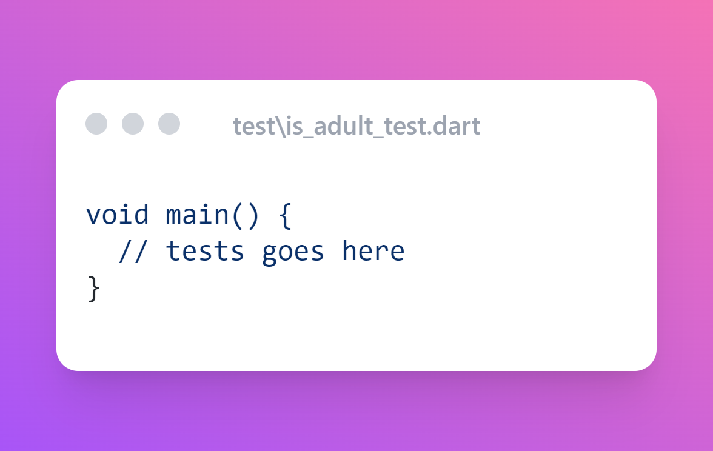
#### AAA Pattern (نمط AAA)
ميكروسوفت بتقترح انك تكتب الاختبار بطريقة AAA
-
Arrange  ثم Act ثم Assert
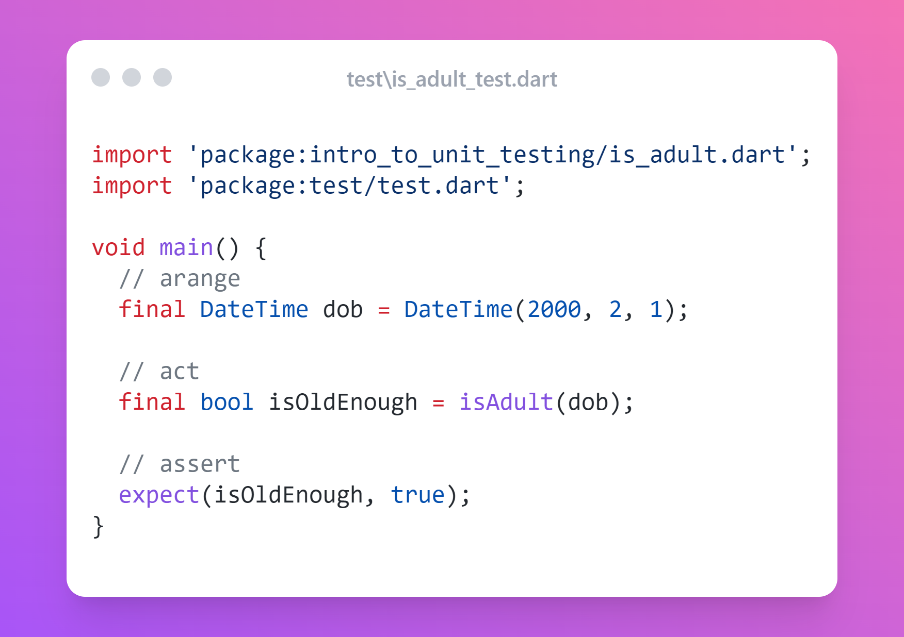

كدا اصبح الكود جاهز وال test جاهز فاضل تشغيل ال test لضمان ان الكود سليم 
بس لازم قبل ماتشغل ال test تكون كاتبة داخل دالة test 

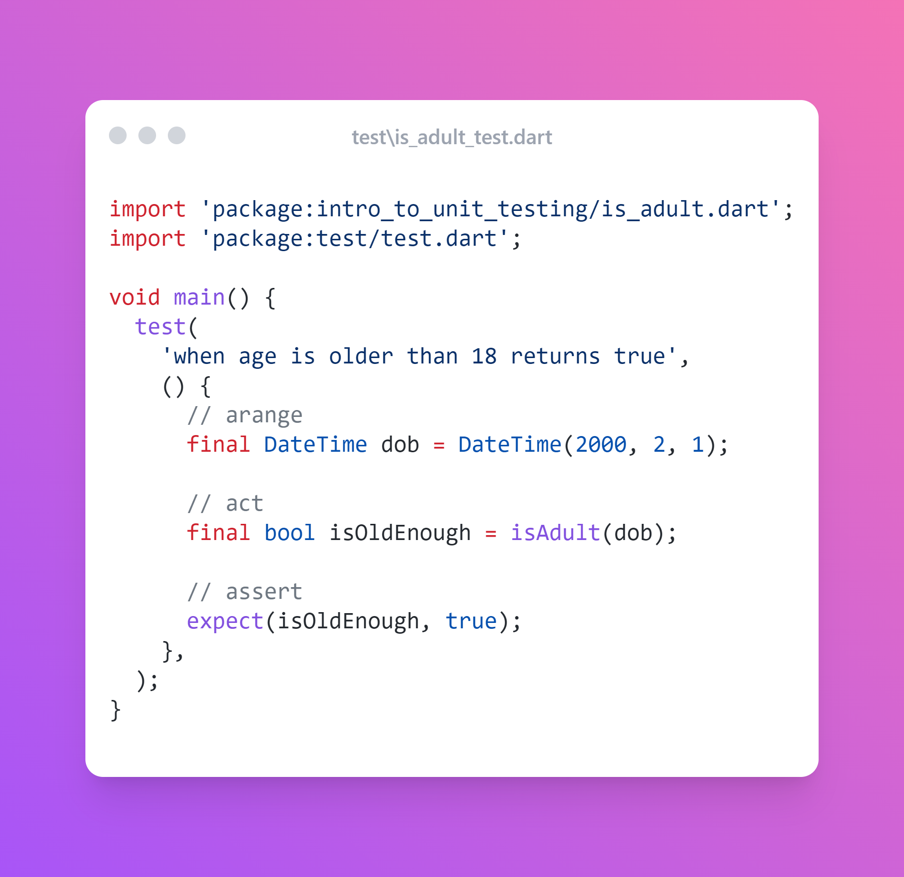
## تشغيل الاختبار
وعلشان تقدر تشغل ال test في اكثر من طريقة
1- عن طريق ال ide سواء vsCode او Android studio
2- عن طريق ال terminal 
هنستخدم ال terminal في باقي الشرح
الامر المستخدم هو flutter test
ودي النتيجة بعد التشغيل ونجاح الاختبار
<center>
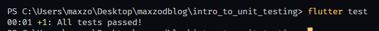
</center>

:::info
حتي الان انت معتمد علي الشرح , توقف وجرب بنفسك اكتب اختبار لو العمر اقل من 18 هيكون الناتج false 
ممكن تكون الدالة الي كتبناها دائما بترجع true بغض النظر عن العمر واحنا محتاجين تتاكد في الحالين ال true و ال false

في اخر المقال هتلاقي المشروع علي GitHub لو احتجت مساعدة 

:::


# المثال الثاني

```
مطلوب بناء داله تقوم بحساب ناتج القسمة بين متغيرين  x , y
وفي حاله ان احدي الرقمين قيمته اقل من صفر يكون الناتج صفر 
```

:::tip
الافضل تعمل بنفسك وتشوف الخطا عندك ايه لكن هنمشي خطوه بخطوة بردو للتوضيح المرادي هنكتب ال test الاول ثم الكود
:::
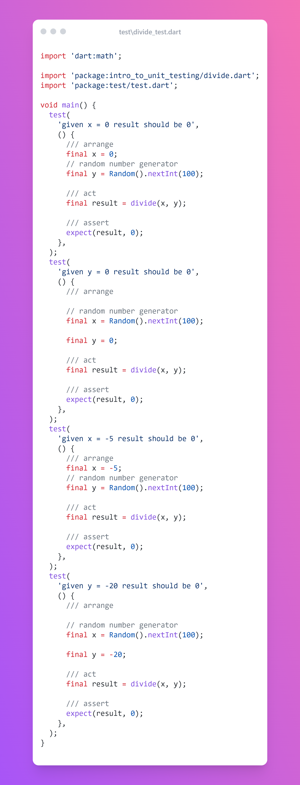


بعد كتابة ال test هنكتب كود الدالة نفسها 

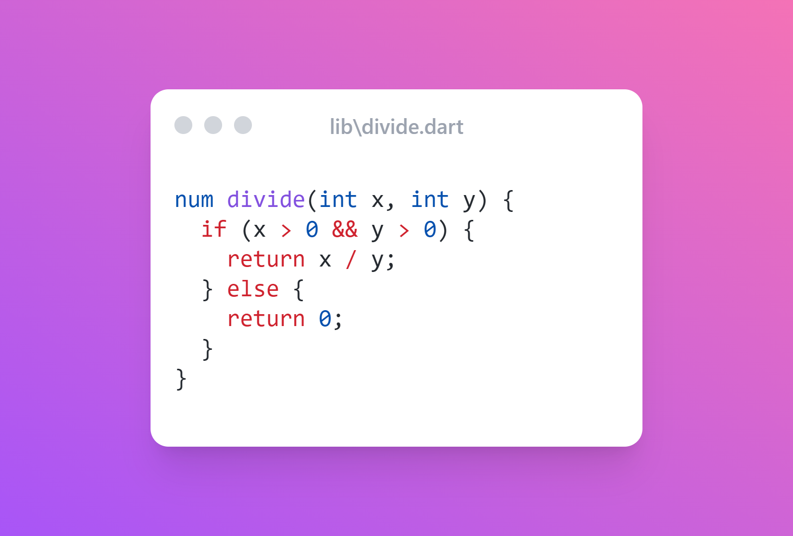

ودي النتيجة بعد تشغيل الامر flutter_test

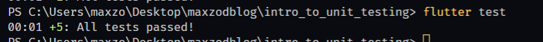


# نسبة التغطية - test coverage
المقصود بيه هل التست الي انت كتبتة للكود شغل الكود كله واختبره كله ولا في حجات انت مختبرتهاش 
مثلا في if else ودايما بينفذ ال if والتستات عمرها مكان فيها test case بتدخل في else علشان تختبرها 

وده بيكون نسبة مئوية %
لو بتختبر مشروع بفلاتر واختبرت الكود كله  نسبتك هتكون 60% تقريبا 
لانك مستخدم كود من فلاتر ومشغلتش التست بتاعه وده طبيعي وعادي 
لو بتعمل برنامج cli او مكتبة ومش معتمد علي مصدر خارجي 
هتقدر ال coverage بتاعتك توصل ل 100%


ازاي اعرف قيمة ال coverage ؟ 
الامر هيكون 
flutter  test --coverage
ده هيطلعلك ملف فيه تقرير التغطية

ومحتاج تستخدم extenstions ل vs code او android studio علشان تعرف منه الاجمالي كام في المئة % 

مثال في vscode

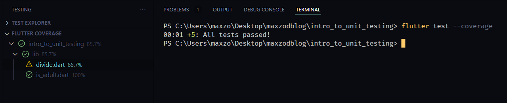
وسبب ان التغطية كانت 85.7% هو اني عملت غلط وانا بكتب كود دالة القسمة واستخدمت &&  and
والصح اني استخدم || or
لان المطلوب كان  اذا كان x او اذا كان y
وهنا vscode بيوضحلي ان الاختبارات مدخلتش هنا ابدا 

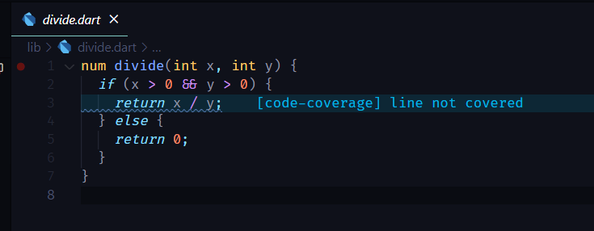

لما نصلحها ونشغل الاختبارات تاني 
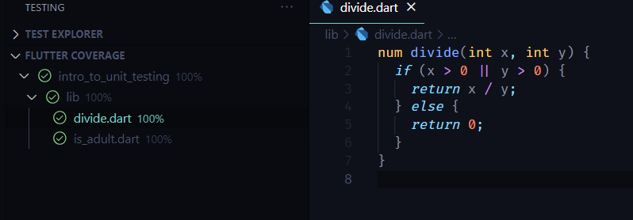


كدا كانت التغيطة 100% 
لكن ال tests فيها 3 فشلو 
ونستنج هنا ان لو التغطية كانت عالية مش شرط ان الاختبارات نجحت لازم نتاكد دائما من الاثنين 

وده الشكل النهائي بعد كتابة دالة القسمة بطريقة صحيحة والتاكد منها بال test والتاكد من coverage 100%
 
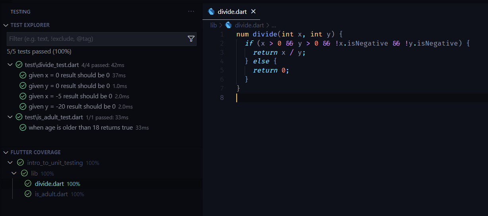

وفي الاخير الاختبارات (testing) في صناعه السوفت وير اوالبرمجيات مهمه بنفس درجه اهتمام شركات الادوية باختبار دوائها او مصانع السيارات في اختبارات الامان في سيراتها انت بتختبر المنتج الي انت عملته وبتضمنه انه دايما بينفذ المطلوب منه وميطلعش سلوك غريب 
:::tip
مكتبة زي riverpod فيه تقريبا 13 الف سطر كود في الاختبارات بس ([المصدر](https://twitter.com/remi_rousselet/status/1451932759933526016))
:::
ممكن تستفاد من ال test مع ال CI / CD وتوفر بيئة عمل مستقرة بشكل كبير وتضمن ان ميطلعش من الكود اي اخطا غير متوقعة نهائيا  وهتقدر تزود الانتجاية وتقلل التكاليف بشكل ملحوظ

مصادر ومكاتب متعلقه بالموضوع :
- [المثال المستخدم في المقال](https://github.com/maxzod/blog/tree/master/intro_to_unit_testing)
 - [(youtube) Flutter Testing For Beginners - The Ultimate Guide](https://youtu.be/RDY6UYh-nyg?si=UVyRmkb0_LVnHgXm)
- [very good coverage (Github Action)](https://github.com/marketplace/actions/very-good-coverage)
- [Unit test basics](https://learn.microsoft.com/en-us/visualstudio/test/unit-test-basics?view=vs-2022)
